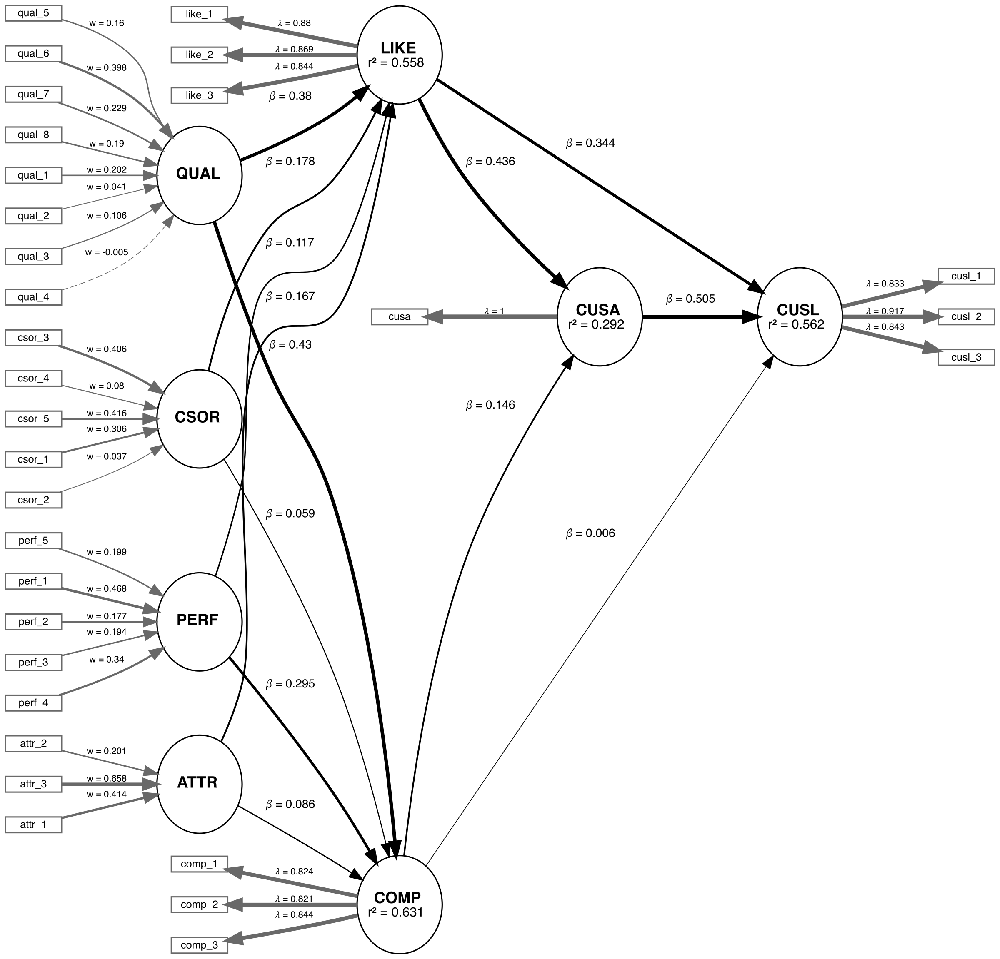

<!-- README.md is generated from README.Rmd. Please edit that file -->


<!--  -->

[](https://cran.r-project.org/package=seminrExtras)
[](https://cran.r-project.org/package=seminrExtras)

SEMinRExtras adds functionality to the SEMinRpackage.

SEMinR (Ray, Danks, & calero-Valdez, 2026) is a domain specific language
for modeling and estimating structural equation models. This is a
supplementary package for SEMinR and not a standalone package. This
package serves to provide additional extra methods and functions that
can be used to analyze PLS-SEM models.

SEMinRExtras provides advanced SEM tools which are compatible with
SEMinR. In the current version, we provide an implementation of the
Cross-Validated Predictive Ability Test (CVPAT) as proposed by Liengaard
et al. (2021) and Sharma et al. (2022).

SEMinRExtras also serves to host the example models used in the PLS-SEM
in R workbook (Hair et al., 2026).

### New features implemented with this package

- assess_cvpat_compare
- assess_cvpat

## The demo files for Hair et al. (2026)

In order to access the demo files for the textbook, you can run the
`demo()` function after loading the SEMinRExtras package.

- seminr-help-debugging
- seminr-pls-cvpat
- seminr-primer-v2-chap2
- seminr-primer-v2-chap3
- seminr-primer-v2-chap4
- seminr-primer-v2-chap5
- seminr-primer-v2-chap6
- seminr-primer-v2-chap7
- seminr-primer-v2-chap8

E.g. `demo("seminr-help-debugging", package = "seminrExtras")`

## The Example model: Corporate Reputation

We are applying the CVPAT process to the corporate reputation example
bundled with SEMinR. Since we will be comparing two models, we will
first estimate and plot both models. Below you will find the competing
and established models which will be compared.

### Established Model



### Competing Model


## Example

``` r

# Create measurement model ----
corp_rep_mm_ext <- constructs(
  composite("QUAL", multi_items("qual_", 1:8), weights = mode_B),
  composite("PERF", multi_items("perf_", 1:5), weights = mode_B),
  composite("CSOR", multi_items("csor_", 1:5), weights = mode_B),
  composite("ATTR", multi_items("attr_", 1:3), weights = mode_B),
  composite("COMP", multi_items("comp_", 1:3)),
  composite("LIKE", multi_items("like_", 1:3)),
  composite("CUSA", single_item("cusa")),
  composite("CUSL", multi_items("cusl_", 1:3))
)

alt_mm <- constructs(
  composite("QUAL", multi_items("qual_", 1:8), weights = mode_B),
  composite("PERF", multi_items("perf_", 1:5), weights = mode_B),
  composite("CSOR", multi_items("csor_", 1:5), weights = mode_B),
  composite("ATTR", multi_items("attr_", 1:3), weights = mode_B),
  composite("COMP", multi_items("comp_", 1:3)),
  composite("LIKE", multi_items("like_", 1:3)),
  composite("CUSA", single_item("cusa")),
  composite("CUSL", multi_items("cusl_", 1:3))
)

# Create structural model ----
corp_rep_sm_ext <- relationships(
  paths(from = c("QUAL", "PERF", "CSOR", "ATTR"), to = c("COMP", "LIKE")),
  paths(from = c("COMP", "LIKE"), to = c("CUSA", "CUSL")),
  paths(from = c("CUSA"),         to = c("CUSL"))
)
alt_sm <- relationships(
  paths(from = c("QUAL", "PERF", "CSOR", "ATTR"), to = c("COMP", "LIKE")),
  paths(from = c("COMP", "LIKE"), to = c("CUSA")),
  paths(from = c("CUSA"),         to = c("CUSL"))
)


# Estimate the models ----
established_model <- estimate_pls(
  data = corp_rep_data,
  measurement_model = corp_rep_mm_ext,
  structural_model  = corp_rep_sm_ext,
  missing = mean_replacement,
  missing_value = "-99")

competing_model <- estimate_pls(
  data = corp_rep_data,
  measurement_model = alt_mm,
  structural_model  = alt_sm,
  missing = mean_replacement,
  missing_value = "-99")

# Function to compare the Loss of two models
compare_results <- assess_cvpat_compare(established_model = established_model,
                                        alternative_model = competing_model,
                                        testtype = "two.sided",
                                        nboot = 2000,
                                        technique = predict_DA,
                                        seed = 123,
                                        noFolds = 10,
                                        reps = 10,
                                        cores = 1)


print(compare_results,
      digits = 3)

# Assess the base model ----
assess_results <- assess_cvpat(established_model,
                               seed = 123, 
                               cores = 1)
print(assess_results$CVPAT_compare_LM,
      digits = 3)
print(assess_results$CVPAT_compare_IA,
      digits = 3)
```

## First, conduct CVPAT analysis of the established model.

``` r
# Assess the base model ----
assess_results <- assess_cvpat(established_model,
                               seed = 123, 
                               cores = 1)
print(assess_results$CVPAT_compare_LM,
      digits = 3)
#>         PLS Loss LM Loss   Diff Boot T value Boot P Value
#> COMP       1.196   1.211 -0.015        0.542        0.588
#> LIKE       1.915   2.063 -0.148        3.761        0.000
#> CUSA       0.994   0.983  0.011       -0.489        0.625
#> CUSL       1.560   1.600 -0.040        2.914        0.004
#> Overall    1.416   1.464 -0.048        3.482        0.001
#> 
#> CVPAT as per Sharma et al. (2023).
print(assess_results$CVPAT_compare_IA,
      digits = 3)
#>         PLS Loss IA Loss   Diff Boot T value Boot P Value
#> COMP       1.196   2.023 -0.827        8.580        0.000
#> LIKE       1.915   3.103 -1.187        8.293        0.000
#> CUSA       0.994   1.374 -0.379        5.004        0.000
#> CUSL       1.560   2.663 -1.102        7.572        0.000
#> Overall    1.416   2.290 -0.874       10.301        0.000
#> 
#> CVPAT as per Sharma et al. (2023).
```

The established model has significantly lower predictive loss compared
to both the naive benchmark IA and the LM model. Thus, we can say that
the established model has predictive relevance.

Now we compare the results:

``` r
# Function to compare the Loss of two models
compare_results <- assess_cvpat_compare(established_model = established_model,
                                        alternative_model = competing_model,
                                        testtype = "two.sided",
                                        nboot = 2000,
                                        technique = predict_DA,
                                        seed = 123,
                                        noFolds = 10,
                                        reps = 10,
                                        cores = 1)

print(compare_results, 
      cores = 1,
      digits = 3)
#>         Base Model Loss Alt Model Loss   Diff Boot T value Boot P Value
#> COMP              1.198          1.195  0.003       -0.460        0.645
#> LIKE              1.923          1.933 -0.010        0.883        0.378
#> CUSA              0.988          0.992 -0.004        0.809        0.419
#> CUSL              1.562          1.715 -0.152        3.286        0.001
#> Overall           1.418          1.459 -0.041        3.293        0.001
#> 
#> CVPAT as per Sharma, Liengaard, Hair, Sarstedt, & Ringle, (2023).
#>   Both models under comparison have identical endoogenous constructs with identical measurement models.
#>   Purely exogenous constructs can differ in regards to their relationships with both nomological
#>   partners and measurement indicators.
```

The established model has significantly lower predictive loss compared
to the competing model. Thus, we can say that the established model has
superior predictive performance compared to the competing model.

# References

- Hair, J.F. (Jr), Hult, T.M., Ringle, C.M., Sarstedt, M., Danks, N.P.,
  and Adler, S. (2026). Partial Least Squares Structural Equation
  Modeling (PLS-SEM) Using R (Second Edition) - A Workbook. Springer.
- Liengaard, B. D., Sharma, P. N., Hult, G. T. M., Jensen, M. B.,
  Sarstedt, M., Hair, J. F., & Ringle, C. M. (2021). Prediction:
  coveted,yet forsaken? Introducing a cross‐validated predictive ability
  test in partial least squares path modeling. Decision Sciences, 52(2),
  362-392.
- Ray, S., Danks, N.P., Calero Valdez, A. (2026) SEMinR: Domain-specific
  language for building, estimating, and visualizing structural equation
  models in R.
- Sharma, P. N., Liengaard, B. D., Hair, J. F., Sarstedt, M., &
  Ringle, C. M. (2022). Predictive model assessment and selection in
  composite-based modeling using PLS-SEM: extensions and guidelines for
  using CVPAT. European journal of marketing, 57(6), 1662-1677.
